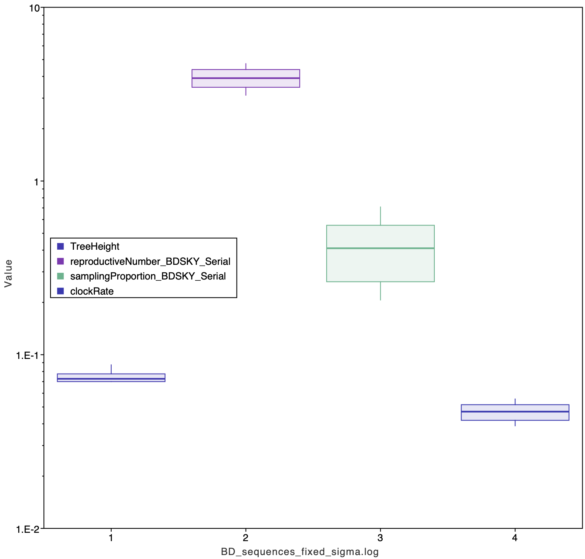
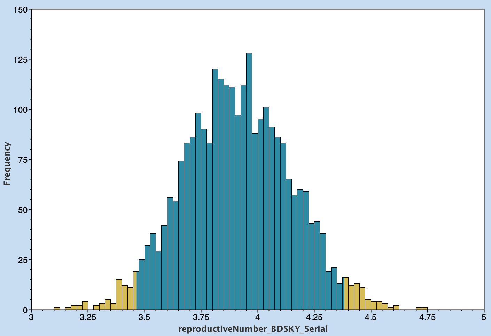
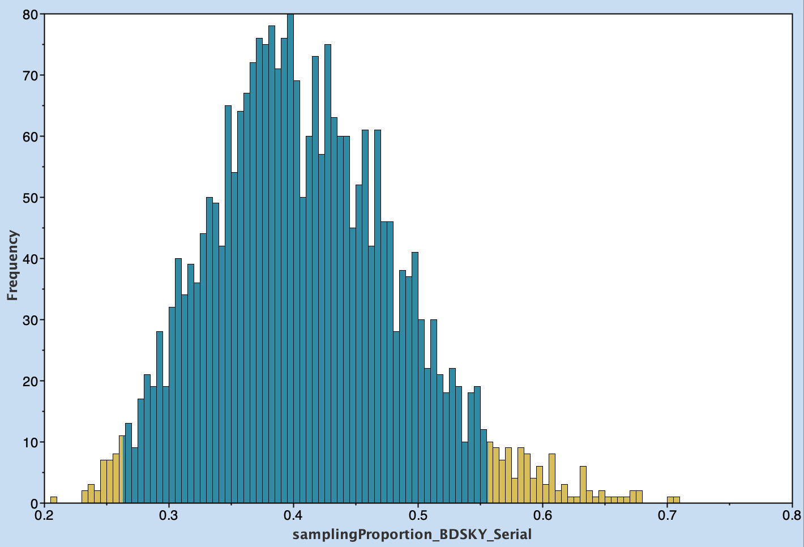
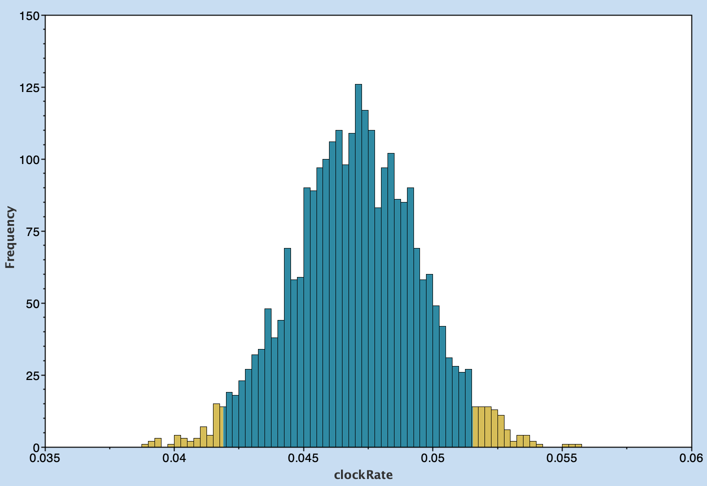

# Understanding the constant birth-death model

## Learning outcomes

Develop a good understanding of the constant birth-death model

## Goals 

Use the BDsky package in BEAST2 to:

- Fit a constant birth-death model.
- Estimate:
    - the reproductive number (R0 here)
    - the sampling proportion
    - TMRCA
    - clock-rate

Choose priors in BEAST2 accordingly. The duration of infection is 10 calendar days, but note that the tree has dates in units of years, so you will need to convert it accordingly. Also note that the duration of infection is not a parameter in beast, so you will need to transform it accordingly. This parameter should be fixed in the model (i.e not estimated).

## Data
- [The simulated sequences](data/BD_sequences.fasta) in fasta format.
- [The timetree](data/BDTree_hetero_fixedN_MASTER.newick.tree) from which the sequences were generated, in case you want to have a look at it.
- [Population trajectories](data/BDTree_MASTER_constant_samp.json) in json format. You don’t need to look at it now, but when you fit the model, we can compare its expectation with these.

## Solution
- https://taming-the-beast.org/tutorials/Skyline-plots/#Heled2008
- https://taming-the-beast.org/tutorials/Prior-selection/
- https://lukejharmon.github.io/pcm/chapter10_birthdeath/
### tip dates 
- extracted dates from tips (assumed decimal years)
### site model 
- gamma cat count 4
- estimate shape 
### clock model 
- strick clock (assumed that because they are sampled over a short time there won't be different rates)
### priors
- Tree: BDskyline serial 
    - (sampled at different times)
- becomeUninfectiousRate: Fixed
    - (the inverse of the becoming uninfectious rate is the average infectious period, 1/duration of infection (days) * 365 days = becomeUninfectiousRate)
    - value 36.5
- clockRate: Log normal
    - (assumed rate of RNA viruses)
    - M 0.001 
    - S 1.25
    - Mean in Real space (initially didn't set this and got low ESS)
- reproductiveNumber: Log normal
    - (assumed within the normal range of pathogens)
    - M 0
    - S 1.25
- origin: Gamma 
    - informs tMRCA (height)
    - alpha 0.5
    - beta 2
- SamplingProportion: Beta
    - (not sure what the prior should be for simulated data so left it as uninformative)
    - alpha 1
    - beta 1

### MCMC
- chain length 3000000 (short for speed)
- log every 3000

## Results

### The reproductive number (R0 here)

### the sampling proportion

### tMRCA

### Clock-rate
